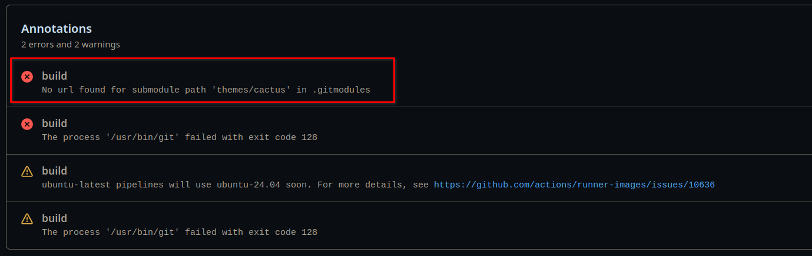

```txt
 _   _      _ _         _   _                  _ 
| | | | ___| | | ___   | | | | _____  _____   | |
| |_| |/ _ \ | |/ _ \  | |_| |/ _ \ \/ / _ \  | |
|  _  |  __/ | | (_) | |  _  |  __/>  < (_) | |_|
|_| |_|\___|_|_|\___/  |_| |_|\___/_/\_\___/  (_)
```


## 1 初见 Hexo

工作多年以来，最近这段时间突然萌生了搭建自己博客的想法。不论是自由表达想法，记录下折腾过程，或是功利性的给别人留下好影响，都让我觉得`It's time to do!`。

在之前的公司我曾用`MkDocs`从零搭建过团队的项目文档平台，但看了下网上大家的讨论，觉得用来做个人博客还是有点不给力，于是采用了最常见的 Hexo + GitHub Pages 方案。

为了减少二次踩坑，我会在这里记录整个折腾博客的过程，并作为我博客的第一篇文章。

## 2 安装

别的不多说，上来的第一步肯定是要浏览一下[官方文档](https://hexo.io/zh-cn/docs/)（文档居然有汉化，看来官方很注重`i18n`）。照着官方文档的安装步骤，在我这台老`Debian`本本上成功安装。

```bash
wzj@wzj-debian:~$ hexo -v
hexo-cli: 4.3.2
os: linux 6.1.0-29-amd64 Debian GNU/Linux 12 (bookworm) 12 (bookworm)
node: 18.19.0
acorn: 8.8.1
ada: 2.7.2
ares: 1.18.1
base64: 0.5.0
brotli: 1.0.9
cjs_module_lexer: 1.2.2
cldr: 42.0
icu: 72.1
llhttp: 6.0.11
modules: 108
napi: 9
nghttp2: 1.52.0
openssl: 3.0.13
simdutf: 3.2.18
tz: 2022e
unicode: 15.0
uv: 1.44.2
uvwasi: 0.0.19
v8: 10.2.154.26-node.28
zlib: 1.2.13
```

## 3 学习基本概念

接下来就是通读一下文档里[配置](https://hexo.io/zh-cn/docs/configuration)和[命令](https://hexo.io/zh-cn/docs/commands)，看完后感觉和`MkDocs`的差不多，看来文档平台的需求很成熟了。接下来照着文档启动本地Hexo，成功后又读了一遍文档里[基本操作](https://hexo.io/zh-cn/docs/writing)部分的内容，大概清楚了Hexo的写作要素和文章存放结构。

## 4 使用主题

既然使用了`Hexo`，那肯定少不了挑一个合适主题美化自己的博客，在浏览[Hexo主题排行](https://www.hexothemes.com/popular/free/)时，我一眼看中了`Cactus`，这货的风格感觉很符合`Unix`的`keep it simple, stupid`哲学。

我直接`git clone`到博客的`themes`目录下，并修改`_config.xml`中`theme: cactus`。然后，Hexo！启动！一切正常。但发现`tags`和`categories`在此主题下显示不了，遂去官方仓库上翻 Issues，正好看到了有人[新增了相关特性](https://github.com/probberechts/hexo-theme-cactus/issues/321)，但 PR 还没被接收，没办法只能先`git clone https://github.com/nkapila6/hexo-theme-cactus.git`（此处有个问题影响部署，若想一次成功，请直接看部署小节的问题修复），重新启动 Hexo，终于有`tags`和`categories`了。

## 5 部署到 GitHub

参考[官方文档部署过程](https://hexo.io/zh-cn/docs/github-pages)提供的如下步骤，推送到自己的`repo`：

1. 在博客项目中建立`.github/workflows/pages.yml`文件，填写内容直接负责官方提供的即可
1. 导航到 GitHub 上的存储库。 转到 Settings 选项卡。 建立名为 <repository 的名字> 的储存库，这样你的博客网址为 <你的 GitHub 用户名>.github.io/<repository 的名字>，repository 的名字可以任意，例如 blog 或 hexo。
1. 编辑你的 _config.yml，将 url: 更改为 <你的 GitHub 用户名>.github.io/<repository 的名字>。
1. 在 GitHub 仓库的设置中，导航至 Settings > Pages > Source 。 将 source 更改为 GitHub Actions，然后保存。
1. Commit 并 push 到默认分支上。
1. 部署完成后，前往 username.github.io/repository 查看网页。

上述步骤操作完成后，查看仓库 GitHub Actions 的记录，发现报错如下



错误信息说找不到`cactus`子模块，原来是本地仓库没有`.gitmodules`配置文件，这个是因为我直接用`git clone`拉取了主题，对博客项目来说，主题应该作为子模块存在才对。于是我清理完旧主题目录后，重新用`git submodule add https://github.com/nkapila6/hexo-theme-cactus.git themes/cactus`拉取了主题，此时项目多了`.gitmodules`配置文件，重新 commit 后就看到 GitHub 上部署成功了。

