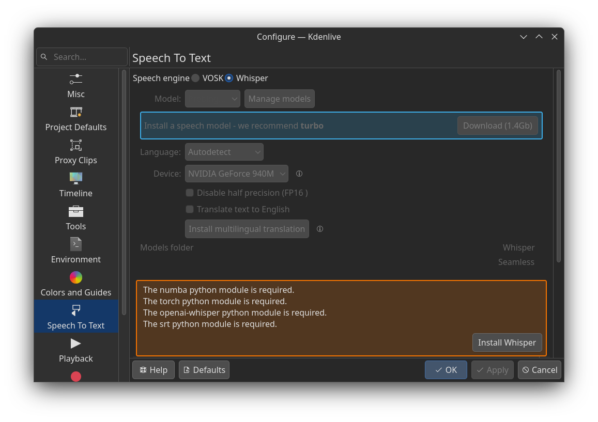
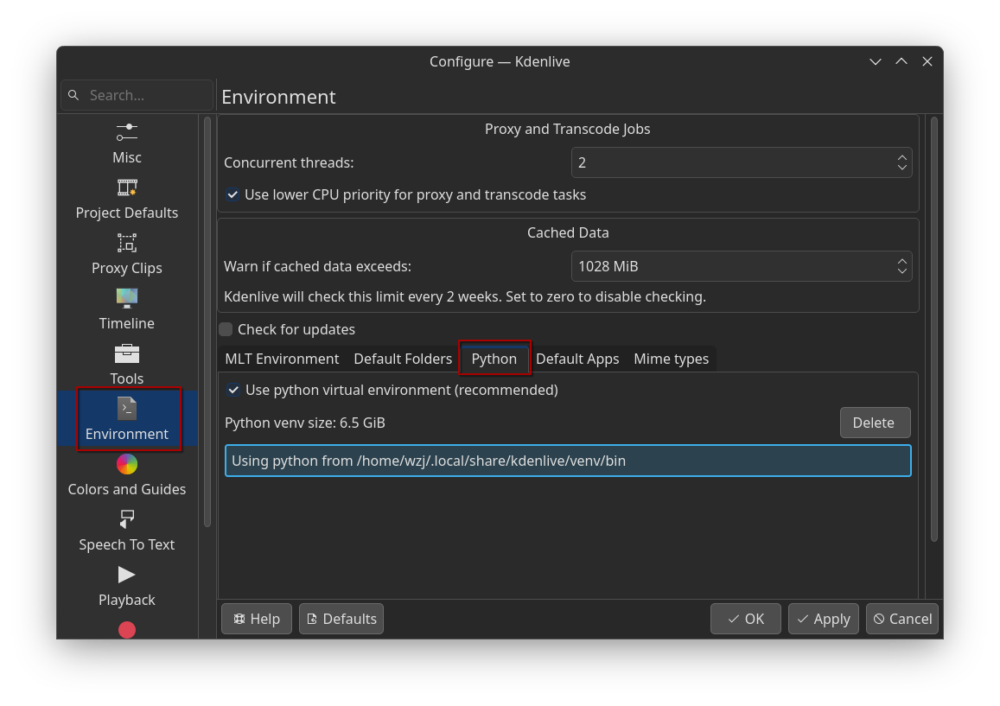

## Whisper 手动安装

Whisper 是 openAI 提供的自动语音识别 (ASR) 系统，Kdenlive 在自己的语音识别特性中支持了集成 Whipser 模型，当我们在下图设置界面点击自动安装时（会提示先安装 venv，然后我手动执行了`sudo apt install python3-venv`），可能因为各种复杂的环境问题导致安装失败，此时我们可以选择手动安装。



1. 打开下图设置中的环境菜单，选择 python 项，检查 Kdenlive 的 python 环境 
2. 我这里显示的是启用了虚拟环境，所以要按照下面的操作安装

```sh
# 已经在自动安装时的提示后安装过了
# sudo apt install python3-venv

# 切换到你自己 kdenlive 设置的 venv，执行完后终端前面会有 venv 的提示，表示此时处于虚拟环境
source ~/.local/share/kdenlive/venv/bin/activate

# 手动安装需要的依赖，安装 openai-whisper 会自动安装其他的依赖
pip install openai-whisper srt

# 退出 venv
deactivate
```
3. 重新打开设置界面，可以看到 Whisper 已经可以修改配置了 