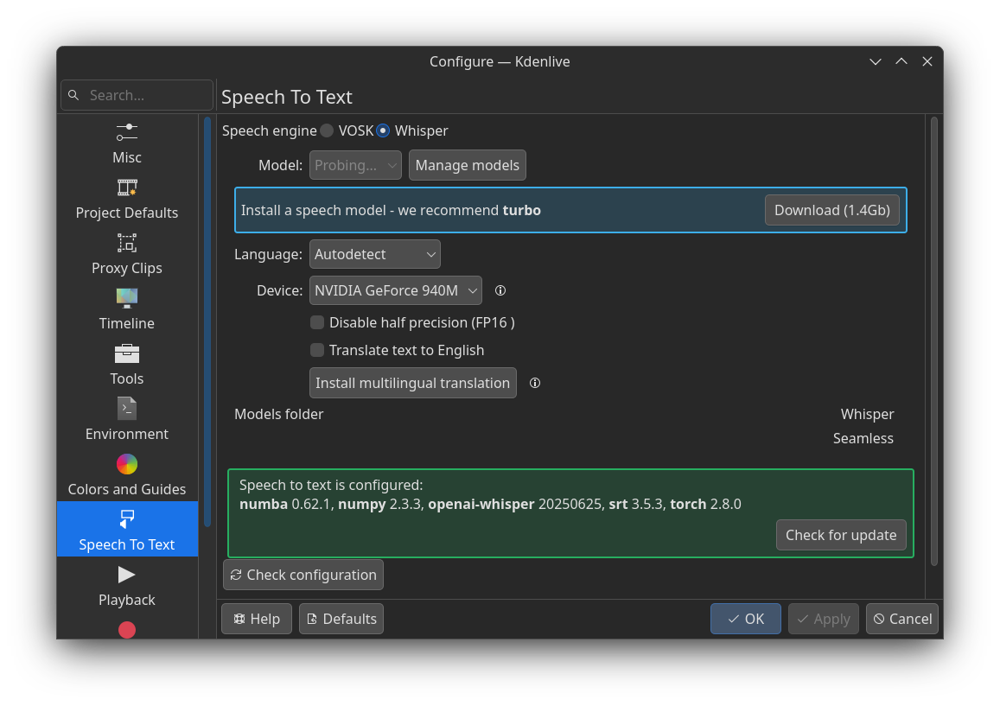

## Whisper 手动安装

Whisper 是 openAI 提供的自动语音识别 (ASR) 系统，Kdenlive 在自己的语音识别特性中支持了集成 Whipser 模型，当我们在下图设置界面点击自动安装时（会提示先安装 venv，然后我手动执行了`sudo apt install python3-venv`），可能因为各种复杂的环境问题导致安装失败，此时我们可以选择手动安装。


1. 打开下图设置中的环境菜单，选择 python 项，检查 Kdenlive 的 python 环境。 
2. 我这里显示的是启用了虚拟环境，所以要按照下面的操作安装。
```sh
# 已经在自动安装时的提示后安装过了
# sudo apt install python3-venv

# 切换到你自己 kdenlive 设置的 venv，执行完后终端前面会有 venv 的提示，表示此时处于虚拟环境
source ~/.local/share/kdenlive/venv/bin/activate

# 手动安装需要的依赖，安装 openai-whisper 会自动安装其他的依赖
pip install openai-whisper srt

# 退出 venv
deactivate
```
3. 重新打开设置界面，可以看到 Whisper 已经可以修改配置了。 
4. 如果下载模型时发现无响应，需要检查下`~/.cache/whisper`目录是否存在，不存在会无法下载（尚不清楚哪个版本引入的 bug），执行`mkdir ~/.cache/whisper`创建成功后，模型可以下载。 

5. 对于部分旧的 GPU 设备，可能上面安装的 pytorch 较新，导致选择 GPU 运行模型时报错（不想处理也可选 CPU 运行），此时需要先查看驱动版本再根据版本重新安装对应依赖。比如我这里的 CUDA 版本是 12.4，所以根据 pytorch [官方指引](https://pytorch.org/get-started/locally/)上的建议，需要使用命令`pip3 install torch torchvision --index-url https://download.pytorch.org/whl/cu124` 来安装正确的依赖。
```sh
wzj@wzj-debian:~$ nvidia-smi
Wed Oct  1 00:38:56 2025       
+-----------------------------------------------------------------------------------------+
| NVIDIA-SMI 550.163.01             Driver Version: 550.163.01     CUDA Version: 12.4     |
|-----------------------------------------+------------------------+----------------------+
| GPU  Name                 Persistence-M | Bus-Id          Disp.A | Volatile Uncorr. ECC |
| Fan  Temp   Perf          Pwr:Usage/Cap |           Memory-Usage | GPU-Util  Compute M. |
|                                         |                        |               MIG M. |
|=========================================+========================+======================|
|   0  NVIDIA GeForce 940M            Off |   00000000:01:00.0 Off |                  N/A |
| N/A   68C    P8             N/A /  200W |       0MiB /   2048MiB |      0%      Default |
|                                         |                        |                  N/A |
+-----------------------------------------+------------------------+----------------------+
                                                                                         
+-----------------------------------------------------------------------------------------+
| Processes:                                                                              |
|  GPU   GI   CI        PID   Type   Process name                              GPU Memory |
|        ID   ID                                                               Usage      |
|=========================================================================================|
|  No running processes found                                                             |
+-----------------------------------------------------------------------------------------+

```