## 各类型常用命令

### Generic

```bash
AUTH password # 密码验证
SELECT DbIndex # 切换到DbIndex这个库，一共有16个
HELP @generic/@string/@hash/@list/@set/@sorted-seth # 查看指定group的help文档
KEYS [*pattern?] # 查询KEY
DEL k1 k2 # 删除k1和k2
EXISTS k1 # 判断KEY是否存在
EXPIRE k1 10 # 使k1在10秒后过期
TTL k1 # 查看k1的剩余有效秒数，永久有效为-1，已删除为-2
SAVE # 主进程做rdb写盘，会阻塞所有命令
```

### String

```bash
# 该类型包括字符串、整数、浮点数

SET k1 v1 # 设置k1的值为v1
GET k1 # 获取k1的值
MSET k1 v1 k2 v2 # 同时设置k1的值为v1，k2的值为v2
MGET k1 k2 # 同时获取k1和k2的值
INCR k1 # k1自增1
INCRBY k1 2 # k1自增2
INCRBYFLOAT k1 0.5 # k1自增0.5
SETNX k1 v1 # k1不存在才增加
SETEX k1 10 v1 # k1不存在才增加并设置有效期
STRLEN k1 # 查看k1长度
```

### Hash

```bash
HSET k1 f1 v1 # 设置k1中field为f1的值为v1
HGET k1 f1 # 获取k1中field为f1的值
HMSET k1 f1 v1 f2 v2 # 同时设置k1中field为f1的值为v1，field为f2的值为v2
HMGET k1 f1 f2 # 同时获取k1中field为f1和f2的值
HGETALL k1 # 获取k1所有的field和value
HKEYS k1 # 获取k1所有的field
HVALS k1 # 获取k1所有的value
HINCRBY k1 f1 1 # k1中f1的值自增1
HSETNX k1 f1 v1 # f1不存在才增加
```

### List

```bash
LPUSH k1 e1 # 从左边压入一个元素到k1
LPOP k1 # 从k1左边弹出一个元素
RPUSH k1 e1 # 从右边压入一个元素到k1
RPOP k1 # 从k1右边弹出一个元素
LRANGE k1 0 2 # 查看k1中索引为0到2的元素，列表元素对应索引从列表左侧到右侧依次增大，起始为0
BLPOP k1 # 从k1左边弹出一个元素，为空阻塞直到不空
BRPOP k1 # 从k1右边弹出一个元素，为空阻塞直到不空
LLEN k1 # 查看列表k1元素个数
```

### Set

```bash
SADD k1 m1 m2 # 集合set增加m1和m2元素
SREM k1 m1 m2 # 集合set删除m1和m2元素
SCARD k1 # 查看k1包含的元素个数
SISMEMBER k1 m1 # 判断m1是否是k1的元素
SMEMBERS k1 # 返回集合中的所有元素

# 集合运算类
SINTER k1 k2 # 返回k1和k2的交集
SDIFF k1 k2 k3 # 返回k1存在但k2和k3不存在的元素，即k1独有的元素
SUNION k1 k2 # 返回k1和k2的并集
```

### SortedSet

```bash
# SortedSet通过分数来为集合中的成员进行从小到大的排序

ZADD k1 s1 m1 s2 m2 # 将m1以s1分，m2以s2分，存入k1
ZREM k1 m1 # 删除k1中的m1元素
ZSCORE k1 m1 # 查看k1中m1元素的分数
ZRANK k1 m1 # 查看k1中m1元素的索引（排名减1）
ZCARD k1 # 查看k1中元素的个数
ZCOUNT k1 minScore maxScore # 查看k1中分数在[minScore, maxScore]范围的元素个数
ZINCRBY k1 2 m1 # k1中m1的分数自增2

# 默认升序排列，如要降序，Z后面加REV即可，如ZREVRANK
ZRANGE k1 minIndex maxIndex # 查看k1中索引（排名减1）在[minIndex, maxIndex]范围的元素
ZRANGEBYSCORE k1 minScore maxScore # 查看k1中分数在[minScore, maxScore]范围的元素
```

### Geo

```bash
GEOADD k1 j1 w1 m1 j2 w2 m2 # 在k1中增加m1（经度j1，维度w1）和m2（经度j2，维度w2）
GEOPOS k1 m1 # 查看k1中m1的经纬度
GEOHASH k1 m1 # 查看k1中m1的经纬度的hash表示
GEODIST k1 m1 m2 km # 查看k1中m1和m2的距离，以km为单位
GEOSEARCH k1 FROMLONLAT j w BYRADIUS 10 km WITHDIST # 在k1中查找，以指定地点（经度j、维度w）为圆心，半径为10km的圆形范围内的元素
```

### BitMap

```bash
SETBIT b1 p1 0/1 # 设置b1的第p1位为0或1
GETBIT b1 p1 # 获取b1的第p1位的值
BITCOUNT b1 # 获取b1中值为1的位数
BITFIELD b1 GET u/i2 1 # 从1开始读2位并返回十进制表示
BITOP AND/OR/NOT/XOR b b1 b2 # 把b1和b2的运算结果放入b中
```

### HyperLogLog

```bash
PFADD h1 e1 e2 # 向h1中添加e1和e2
PFCOUNT h1 # 判断h1中元素个数
PFMERGE h h1 h2 # 合并h1和h2到h
```

## Java 客户端

### Jedis

```java
public class JedisConnectionFactory {
    private static final JedisPool jedisPool;

    static {
        JedisPoolConfig jedisPoolConfig = new JedisPoolConfig();
        // 最大连接
        jedisPoolConfig.setMaxTotal(8);
        // 最大空闲连接
        jedisPoolConfig.setMaxIdle(8); 
        // 最小空闲连接
        jedisPoolConfig.setMinIdle(0);
        // 设置最长等待时间， ms
        jedisPoolConfig.setMaxWaitMillis(200);
        jedisPool = new JedisPool(jedisPoolConfig, "192.168.150.101", 6379,
                1000, "123321");
    }
    // 获取Jedis对象
    public static Jedis getJedis(){
        return jedisPool.getResource();
    }
}
```

### SpringDataRedis

RedisTemplate 的两种序列化实践方案如下：

1. 方案一
	- 自定义 RedisTemplate
	- 修改 RedisTemplate 的序列化器为 GenericJackson2JsonRedisSerializer
2. 方案二
	- 使用 StringRedisTemplate
	- 写入 Redis 时，手动把对象序列化为 JSON
	- 读取 Redis 时，手动把读取到的 JSON 反序列化为对象

## 缓存一致性

### 缓存更新

删除缓存还是更新缓存？

- 更新缓存：每次更新数据库都更新缓存，无效写操作较多
- 删除缓存：更新数据库时让缓存失效，查询时再更新缓存

如何保证缓存与数据库的操作的同时成功或失败？

- 单体系统：将缓存与数据库操作放在一个事务
- 分布式系统：利用 TCC 等分布式事务方案

缓存和数据库操作顺序有什么影响？

- 先删缓存再改库

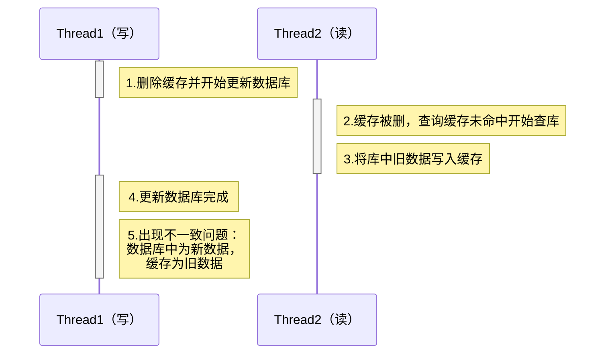

- 先改库再删缓存

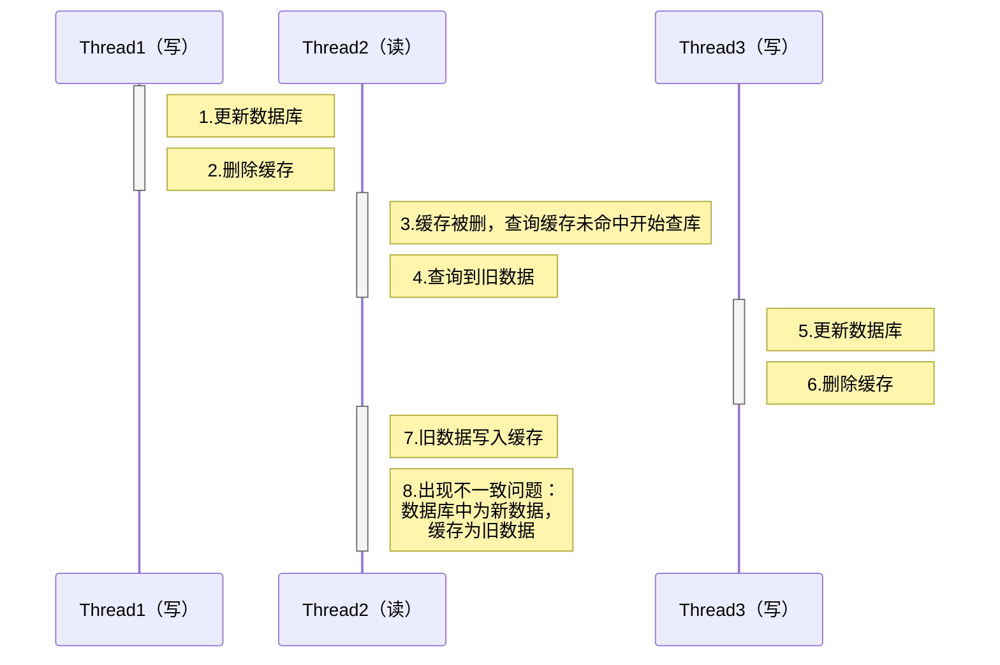

- 延迟删除
  - 对于上述两种场景下的缓存不一致问题，可以在写线程最后加一个延迟一定时间的缓存删除操作

最佳实践方案如何？

1. 低一致性需求：使用 Redis 自带的内存淘汰机制
2. 高一致性需求：主动更新，并以超时剔除作为兜底方案
	- 读操作：
		- 缓存命中则直接返回
			- 缓存未命中则查询数据库，并写入缓存，设定超时时间
	- 写操作：
		- 先写数据库，然后再删除缓存
		- 要确保数据库与缓存操作的原子性

### 缓存穿透

**缓存穿透**是指客户端请求的数据在缓存中和数据库中都不存在，这样缓存永远不会生效，这些请求都会打到数据库。

常见的解决方案有两种：
1. 缓存空对象
	- 优点：实现简单，维护方便
	- 缺点：额外的内存消耗，可能造成短期的不一致
2. 布隆过滤
	- 优点：内存占用较少，没有多余 key
	- 缺点：实现复杂，存在误判可能

### 缓存雪崩

**缓存雪崩**是指在同一时段大量的缓存 key 同时失效或者 Redis 服务宕机，导致大量请求到达数据库，带来巨大压力。

常见的解决方案：
- 给不同的 Key 的 TTL 添加随机值
- 利用 Redis 集群提高服务的可用性
- 给缓存业务添加降级限流策略
- 给业务添加多级缓存

### 缓存击穿

**缓存击穿**问题也叫热点 Key 问题，就是一个被高并发访问并且缓存重建业务较复杂的 key 突然失效了，无数的请求访问会在瞬间给数据库带来巨大的冲击。

| 解决方案 | 优点                               | 缺点                              |
| ---- | -------------------------------- | ------------------------------- |
| 互斥锁  | 1.没有额外的内存消耗<br>2.保证一致性<br>3.实现简单 | 线程需要等待，性能受影响<br>可能有死锁风险         |
| 逻辑过期 | 线程无需等待，性能较好                      | 1.不保证一致性<br>2.有额外内存消耗<br>3.实现复杂 |

- 互斥锁方案

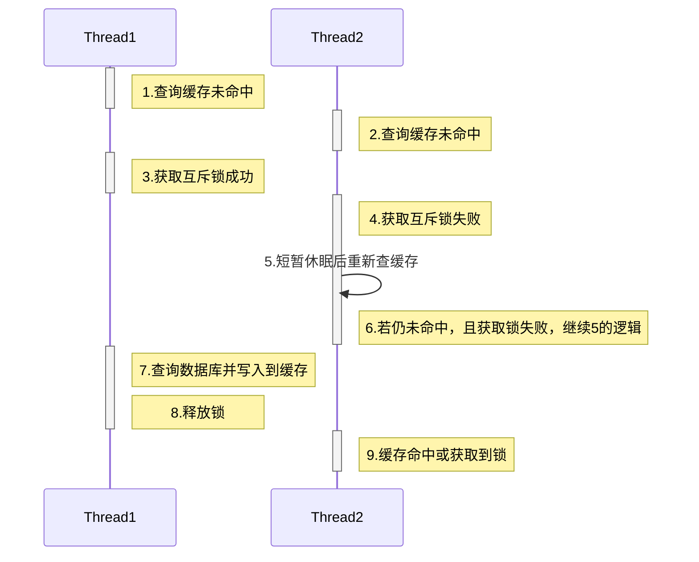

- 逻辑过期方案

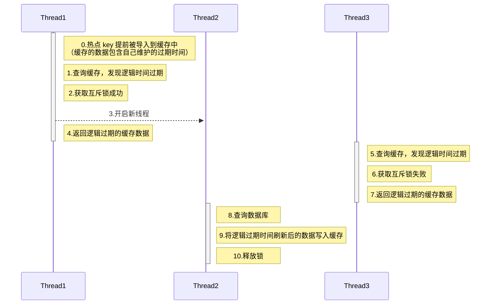

### 缓存同步

缓存数据同步的常见方式有三种：
- **设置有效期**：给缓存设置有效期，到期后自动删除。再次查询时更新
  - 优势：简单、方便
  - 缺点：时效性差，缓存过期之前可能不一致
  - 场景：更新频率较低，时效性要求低的业务
- **同步双写**：在修改数据库的同时，直接修改缓存
  - 优势：时效性强，缓存与数据库强一致
  - 缺点：有代码侵入，耦合度高；
  - 场景：对一致性、时效性要求较高的缓存数据
- **异步通知**：修改数据库时发送事件通知，相关服务监听到通知后修改缓存数据
  - 优势：低耦合，可以同时通知多个缓存服务
  - 缺点：时效性一般，可能存在中间不一致状态
  - 场景：时效性要求一般，有多个服务需要同步

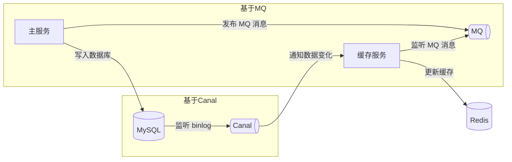


## 分布式锁

### 自己实现

基于 Redis 的分布式锁实现思路：
- 利用`set nx ex`获取锁，并设置过期时间，保存线程标示
- 释放锁时先判断线程标示是否与自己一致，一致则删除锁

特性：
- 利用`set nx`满足互斥性
- 利用`set ex`保证故障时锁依然能释放，避免死锁，提高安全性
- 利用 Redis 集群保证高可用和高并发特性

存在的问题：
- 不可重入：同一个线程无法多次获取同一把锁
- 不可重试：获取锁只尝试一次就返回 false，没有重试机制
- 超时释放：锁超时释放虽然可以避免死锁，但如果是业务执行耗时较长，也会导致锁释放，存在安全隐患
- 主从一致性：如果 Redis 提供了主从集群，主从同步存在延迟，当主宕机时，如果从并同步主中的锁数据，则会出现锁实现

### 使用Redisson

Redisson 是一个在 Redis 的基础上实现的 Java 驻内存数据网格（In-Memory Data Grid）。它不仅提供了一系列的分布式的 Java 常用对象，还提供了许多分布式服务，其中就包含了各种分布式锁的实现。

Redisson 分布式锁原理：
- 可重入：利用hash结构记录线程 id（`hset lockKey threadId 1`）和重入次数（`hincrby lockKey threadId 1`）
- 可重试：利用信号量和 PubSub 功能实现等待、唤醒，获取锁失败的重试机制
- 超时续约：利用 watchDog，每隔一段时间（releaseTime / 3），重置超时时间

## 持久化

### RDB

RDB 全称 Redis Database Backup file（Redis数据备份文件），也被叫做 Redis 数据快照。简单来说就是把内存中的所有数据都记录到磁盘中。当 Redis 实例故障重启后，从磁盘读取快照文件，恢复数据。

快照文件称为 RDB 文件，默认是保存在当前运行目录。Redis 停机时会执行一次 RDB。

`bgsave`的基本流程？
- fork 主进程得到一个子进程，共享内存空间
- 子进程读取内存数据并写入新的 RDB 文件
- 用新 RDB 文件替换旧的 RDB 文件。

RDB 的缺点？
- RDB 执行间隔时间长，两次 RDB 之间写入数据有丢失的风险
- fork 子进程、压缩、写出 RDB 文件都比较耗时
### AOF

AOF 全称为 Append Only File（追加文件）。Redis 处理的每一个写命令都会记录在 AOF 文件，可以看做是命令日志文件。

因为是记录命令，AOF 文件会比 RDB 文件大的多。而且 AOF 会记录对同一个 key 的多次写操作，但只有最后一次写操作才有意义。通过执行`bgrewriteaof`命令，可以让 AOF 文件执行重写功能，用最少的命令达到相同效果。

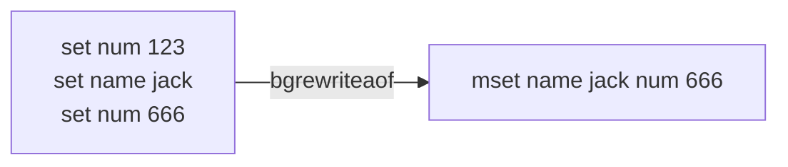
### 两种方式的比较

|   比较项   |          RDB           |               AOF                |
| :-----: | :--------------------: | :------------------------------: |
|  持久化方式  |       定时对整个内存做快照       |            记录每一次执行的命令            |
|  数据完整性  |     不完整，两次备份之间会丢失      |           相对完整，取决于刷盘策略           |
|  文件大小   |       会有压缩，文件体积小       |           记录命令，文件体积很大            |
| 宕机恢复速度  |           很快           |                慢                 |
| 数据恢复优先级 |     低，因为数据完整性不如 AOF     |           高，因为数据完整性更高            |
| 系统资源占用  |      高，大量 CPU 和内存消耗      | 低，主要是磁盘 IO 资源 但 AOF 重写时会占用大量 CPU 和内存资源 |
|  使用场景   | 可以容忍数分钟的数据丢失，追求更快的启动速度 |           对数据安全性要求较高常见           |

## 集群模式

### 主从

- 架构图

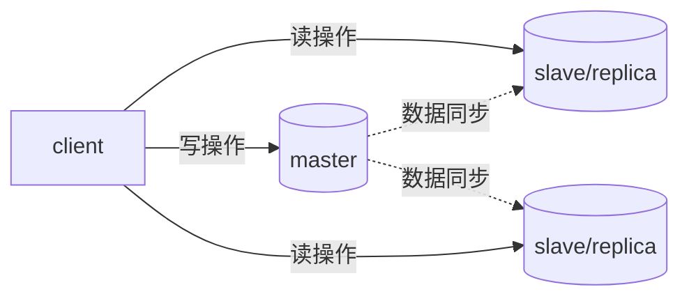

- 数据同步原理

Replication Id：简称 replid，是数据集的标记，id 一致则说明是同一数据集。每一个 master 都有唯一的 replid，slave 则会继承 master 节点的 replid

offset：偏移量，随着记录在 repl_baklog 中的数据增多而逐渐增大。slave 完成同步时也会记录当前同步的 offset。如果 slave 的 offset 小于 master 的 offset，说明 slave 数据落后于 master，需要更新。

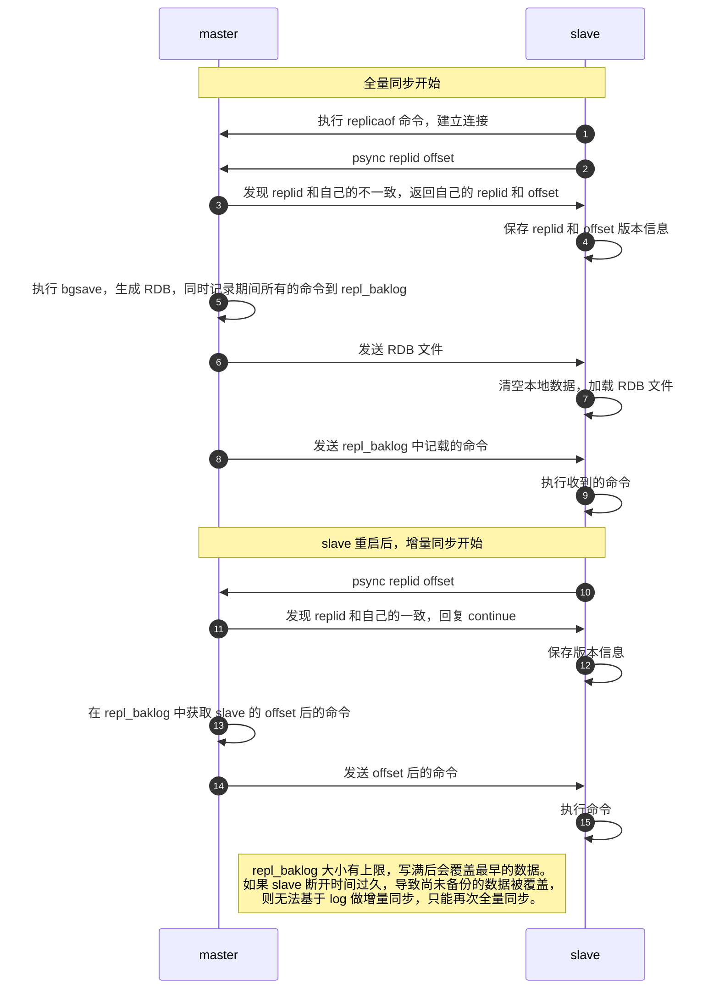

### 哨兵

哨兵（sentinel）的作用：

- **监控**：基于心跳机制监测服务状态，每隔 1 秒向集群的每个实例发送`ping`命令
  - 主观下线：如果某哨兵节点发现某实例未在规定时间响应，则认为该实例主观下线。
  - 客观下线：若超过指定数量（quorum）的哨兵都认为该实例主观下线，则该实例客观下线。quorum 值最好超过哨兵实例数量的一半。

- **自动故障恢复**：如果 master 故障，哨兵会将一个 slave 提升为 master。当故障实例恢复后也以新的 master 为主
  - 首先选定一个 slave 作为新的 master，执行`slaveof no one`
    1. 首先会判断 slave 节点与 master 节点断开时间长短，如果超过指定值（down-after-milliseconds * 10）则会排除该 slave 节点
    2. 然后判断 slave 节点的 slave-priority 值，越小优先级越高，如果是 0 则永不参与选举
    3. 如果 slave-prority 一样，则判断 slave 节点的 offset 值，越大说明数据越新，优先级越高
    4. 最后是判断 slave 节点的运行 id 大小，越小优先级越高。
  - 然后让所有节点都执行`slaveof 新master`
  - 修改故障节点，执行`slaveof 新master`

- **通知**：哨兵充当 Redis 客户端的服务发现来源，当集群发生故障转移时，会将最新信息推送给 Redis 的客户端

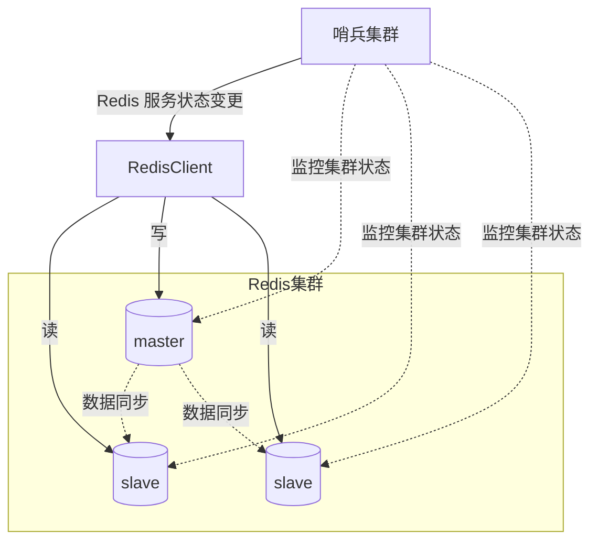

### 分片

分片集群特征：

- 集群中有多个 master，每个 master 保存不同数据
- 每个 master 都可以有多个 slave 节点
- master 之间通过 ping 监测彼此健康状态
- 客户端请求可以访问集群任意节点，最终都会被转发到正确节点

散列插槽

- Redis 会把每一个 maste r节点映射到 0 ~ 16383 共 16384 个插槽（hash slot）上
- 数据 key 不是与节点绑定，而是与插槽绑定。redis 会根据 key 的有效部分计算插槽值，分两种情况：
  - key 中包含"{}"，且“{}”中至少包含 1 个字符，“{}”中的部分是有效部分
  - key 中不包含“{}”，整个 key 都是有效部分

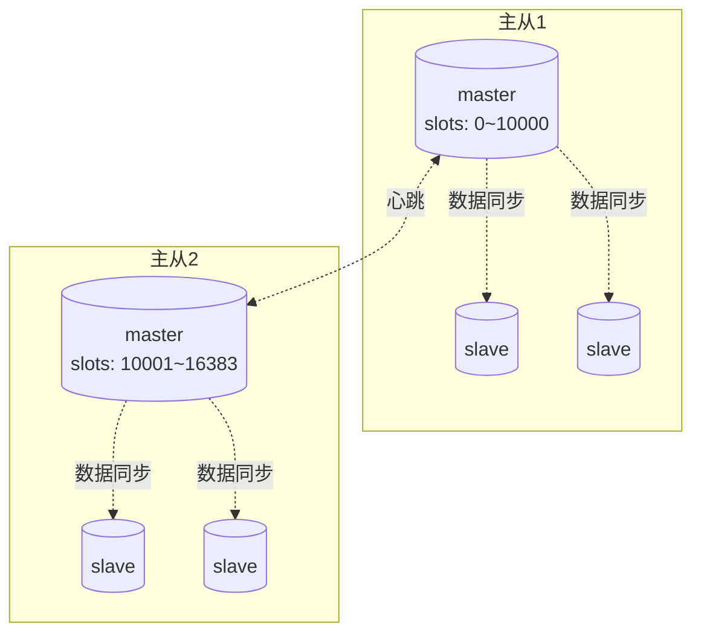

## 最佳实践

### 优雅Key

最佳实践约定:

- 遵循基本格式：[业务名称]:[数据名]:[id]
- 长度不超过 44 字节
- 不包含特殊字符

优点：

- 可读性强
- 避免 key 冲突
- 方便管理
- 更节省内存： key 是 string 类型，底层编码包含 int、embstr 和 raw 三种。embstr 在小于 44 字节使用，采用连续内存空间，内存占用更小

### BigKey

危害:

- **网络阻塞**：对 BigKey 执行读请求时，少量的 QPS 就可能导致带宽使用率被占满，导致 Redis 实例，乃至所在物理机变慢
- **数据倾斜**：BigKey 所在的 Redis 实例内存使用率远超其他实例，无法使数据分片的内存资源达到均衡
- **Redis阻塞**：对元素较多的 hash、list、zset 等做运算会耗时较旧，使主线程被阻塞
- **CPU压力**：对 BigKey 的数据序列化和反序列化会导致 CPU 的使用率飙升，影响 Redis 实例和本机其它应用

删除方式：

- Redis 3.0 及以下版本：如果是集合类型，则遍历 BigKey 的元素，先逐个删除子元素，最后删除 BigKey
- Redis 4.0 以后：Redis 在 4.0 后提供了异步删除的命令`unlink`

### 一般批处理

批量处理的方案：

- 原生的`MSET`、`HMSET`等 Mxx 操作
- Pipeline 批处理

注意事项：

- 批处理时不建议一次携带太多命令
- Pipeline 的多个命令之间不具备原子性

### 集群下批处理

如 MSET 或 Pipeline 这样的批处理需要在一次请求中携带多条命令，而此时如果 Redis 是一个集群，那批处理命令的多个 key 必须落在一个插槽中，否则就会导致执行失败。

|      | 串行命令             | 串行slot                                                  | 并行slot                                                  | hash_tag                            |
| :-: | --- | --- | --- | --- |
| 思路 | for循环遍历，依次执行每个命令 | 在客户端计算每个key的slot，将slot一致分为一组，每组都利用Pipeline批处理。 串行执行各组命令 | 在客户端计算每个key的slot，将slot一致分为一组，每组都利用Pipeline批处理。 并行执行各组命令 | 将所有key设置相同的hash_tag，则所有key的slot一定相同 |
| 耗时   | N次网络耗时 + N次命令耗时  | m次网络耗时 + N次命令耗时 m = key的slot个数                          | 1次网络耗时 + N次命令耗时                                         | 1次网络耗时 + N次命令耗时                     |
| 优点   | 实现简单             | 耗时较短                                                    | 耗时非常短                                                   | 耗时非常短、实现简单                          |
| 缺点   | 耗时非常久            | 实现稍复杂slot越多，耗时越久                                       | 实现复杂                                                    | 容易出现数据倾斜                            |

## Redis对象

对象定义如下：

```c
/*
* 对象类型
*/
#define OBJ_STRING 0 // 字符串
#define OBJ_LIST 1 // 列表
#define OBJ_SET 2 // 集合
#define OBJ_ZSET 3 // 有序集
#define OBJ_HASH 4 // 哈希表

/*
* 对象编码
*/
#define OBJ_ENCODING_RAW 0     /* raw编码动态字符串 */
#define OBJ_ENCODING_INT 1     /* long类型的整数的字符串 */
#define OBJ_ENCODING_HT 2      /* hash表（字典dict） */
#define OBJ_ENCODING_ZIPMAP 3  /* 注意：版本2.6后不再使用. */
#define OBJ_ENCODING_LINKEDLIST 4 /* 注意：不再使用了，旧版本2.x中String的底层之一. */
#define OBJ_ENCODING_ZIPLIST 5 /* 压缩列表 */
#define OBJ_ENCODING_INTSET 6  /* 整数集合 */
#define OBJ_ENCODING_SKIPLIST 7  /* 跳表 */
#define OBJ_ENCODING_EMBSTR 8  /* embstr的动态字符串 */
#define OBJ_ENCODING_QUICKLIST 9 /* 快速列表 */
#define OBJ_ENCODING_STREAM 10 /* Stream流 */

typedef struct redisObject {
    unsigned type:4; // 对象类型，分别是string、hash、list、set和zset，占4个bit位
    unsigned encoding:4; // 底层编码方式，共有11种，占4个bit位
    unsigned lru:LRU_BITS; // LRU时是24位, 记录最末一次访问时间（相对于lru_clock）; 或者LFU（最少使用的数据：8位频率，16位访问时间）
    int refcount; // 对象引用计数器，计数器为0则说明对象无人引用，可以被回收
    void *ptr; // 指向底层数据结构实例
} robj;
```

各类型的编码和底层结构关联如下：

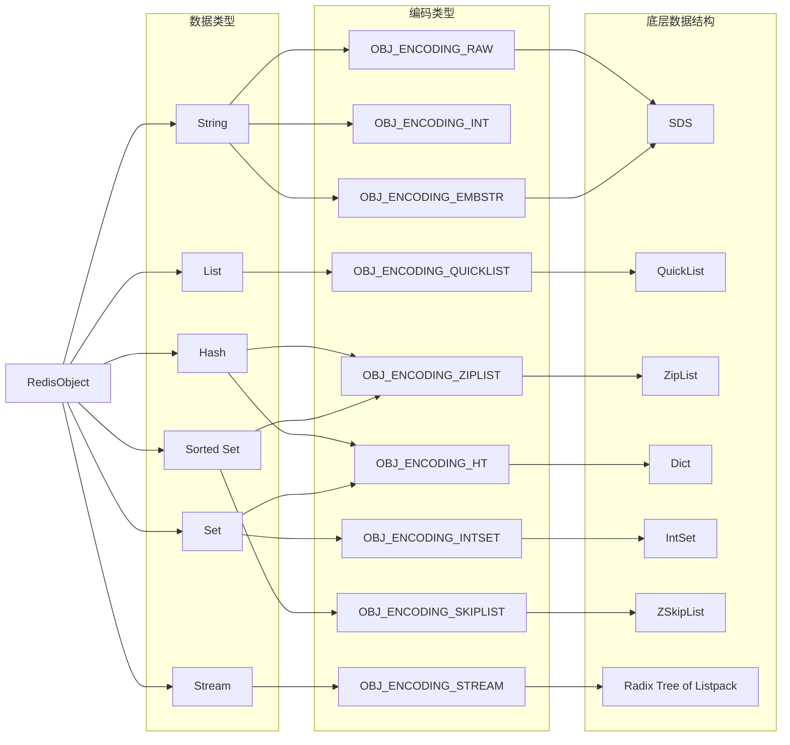

## 对象底层数据结构

### SDS

Redis 是用 C 语言写的，但是对于 Redis 的字符串，却不是 C 语言中的字符串（即以空字符’\0’结尾的字符数组），它是自己构建了一种名为简单动态字符串（simple dynamic string,SDS）的抽象类型，并将 SDS 作为 Redis 的默认字符串表示。

```c
struct __attribute__ ((__packed__)) sdshdr8 {
    uint8_t len; // buf已使用的字符串字节数，不包含结束标示
    uint8_t alloc; // buf申请的总的字节数，除掉头部与末尾的\0, 剩余的字节数
    unsigned char flags; // 不同SDS的头类型，始终为一字节, 以低三位标示着头部的类型, 高5位未使用
    char buf[];
};
```
he 字符串的SDS内存结构如下：

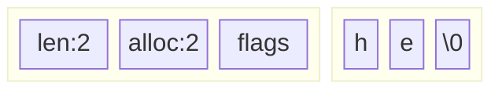

追加字符串会预分配空间：

- 如果新字符串小于 1M，则新空间为扩展后字符串长度的两倍 + 1
- 如果新字符串大于 1M，则新空间为扩展后字符串长度 + 1M + 1

he 字符串通过`APPEND`操作追加 xo 后变为 hexo，此时的 SDS 内存结构如下：

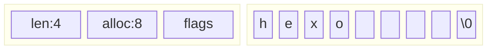

|相比c语言字符串的优势|解释|
|:-:|:--|
杜绝缓冲区溢出|我们知道在 C 语言中使用 strcat 函数来进行两个字符串的拼接，一旦没有分配足够长度的内存空间，就会造成缓冲区溢出。而对于 SDS 数据类型，在进行字符修改的时候，会首先根据记录的 len 属性检查内存空间是否满足需求，如果不满足，会进行相应的空间扩展，然后在进行修改操作，所以不会出现缓冲区溢出。|
|减少修改字符串的内存重新分配次数|C 语言由于不记录字符串的长度，所以如果要修改字符串，必须要重新分配内存（先释放再申请）。而对于 SDS，对字符串进行空间扩展的时候，扩展的内存比实际需要的多，这样可以减少连续执行字符串增长操作所需的内存重分配次数。|
|二进制安全|因为C字符串以空字符作为字符串结束的标识，而对于一些二进制文件（如图片等），内容可能包括空字符串，因此C字符串无法正确存取。而所有 SDS 的 API 都是以处理二进制的方式来处理 buf 里面的元素，并且 SDS 不是以空字符串来判断是否结束，而是以 len 属性表示的长度来判断字符串是否结束。
|计算字符串长度时间复杂度为 O(1)|SDS 有 len 属性。|

### IntSet

IntSet 是 Redis 中 set 集合的一种实现方式，基于整数数组来实现，并且具备长度可变、元素唯一、元素有序等特征。

```c
#define INTSET_ENC_INT16 (sizeof(int16_t)) /* 2字节整数，范围类似java的short */
#define INTSET_ENC_INT32 (sizeof(int32_t)) /* 4字节整数，范围类似java的int */
#define INTSET_ENC_INT64 (sizeof(int64_t)) /* 8字节整数，范围类似java的long */

/* 虽然 intset 结构将 contents 属性声明为 int8_t 类型的数组
但实际上 contents 数组并不保存任何 int8_t 类型的值，
contents 数组的真正类型取决于 encoding 属性的值 */

typedef struct intset {
    uint32_t encoding; /* 编码方式，支持存放16位、32位、64位整数 */
    uint32_t length; /* 元素个数 */
    int8_t contents[]; /* 整数数组，保存集合数据 */
} intset;
```

编码升级：

- 数字超出了编码的范围，intset 会自动升级编码方式到合适的大小
  1. 通过**二分查找**找到待新增元素的顺位
  2. 按照新的编码方式及元素个数扩容数组
  3. 倒序依次将数组中顺位后的元素拷贝到扩容后的正确位置
  4. 将新增元素放入对应顺位
- 下图由上往下展示了在集合 {1,2} 中插入 50000 时的编码升级过程:

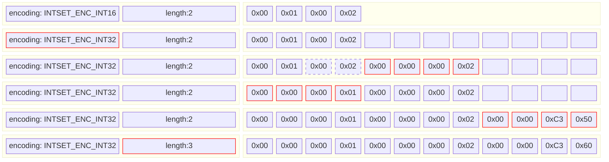

- 删除不会考虑降级是为了减少开销

### Dict

```c
typedef struct dict {
    dictType *type; // dict类型，内置不同的hash函数
    void *privdata;     // 私有数据，在做特殊hash运算时用
    dictht ht[2]; // 一个Dict包含两个哈希表，其中ht[0]是当前数据，ht[1]在rehash过程中才使用
    long rehashidx;   // 当前待rehash的entry表索引，-1表示未进行，每次rehash一个索引后+1
    int16_t pauserehash; // rehash是否暂停，1则暂停，0则继续
} dict;

typedef struct dictht {
    dictEntry **table; // 指向entry指针的数组
    unsigned long size; // 哈希表大小
    unsigned long sizemask; // 哈希表大小的掩码，总等于size - 1
    unsigned long used; // entry个数
} dictht;

typedef struct dictEntry {
    void *key; // 键
    union {
        void *val;
        uint64_t u64;
        int64_t s64;
        double d;
    } v; // 值
    struct dictEntry *next; // 下一个Entry的指针
} dictEntry;
```

- 内存结构

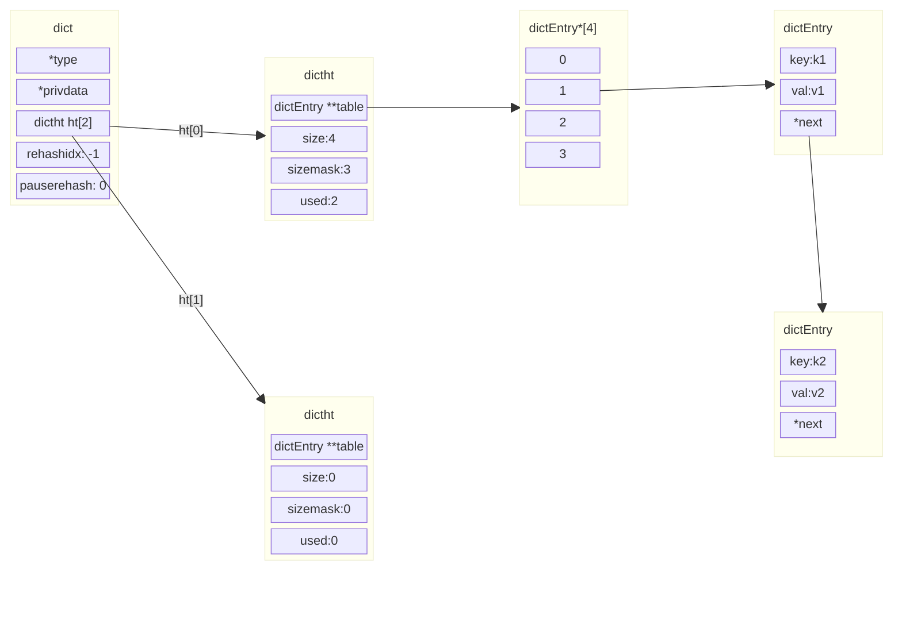

- hash 索引的计算

```c
hash = dict->type->hashFunction(key); // 使用字典设置的哈希函数，计算键key的哈希值
index = hash & dict->ht[x].sizemask; // 再用哈希表的sizemask属性和第一步得到的哈希值求与得到索引值
```

- 根据使用情况优化内存
  - 扩容：在每次新增键值对时都会检查负载因子（ LoadFactor = used / size ），满足以下两种情况时会触发哈希表扩容：
    - 哈希表的 LoadFactor >= 1，并且服务器没有执行 BGSAVE 或者 BGREWRITEAOF 等后台进程；
    - 哈希表的 LoadFactor > 5 ；
  - 收缩：每次删除元素时，对负载因子做检查，当 LoadFactor < 0.1 时，会做哈希表收缩

- rehash：无论扩容还是收缩，哈希的 size 和 sizemask 都会变化，旧 key 需要重新哈希到新的正确位置，但是数据量巨大时，一次性哈希所有的旧 key 会导致 dict 较长时间不可用，所以 Redis 采用了**渐进式** rehash 的方式来操作：
  1. 计算新 hash 表的 size：
     - 扩容：size = 第一个大于等于 dict.ht[0].used + 1 的 $2^n$ 值
     - 缩容：size = 第一个大于等于 dict.ht[0].used 的 $2^n$ 值（最少为 4）
  2. 用新的 size 申请空间给新创建的 dictht，再把新创建的 dictht 赋值给 dict.ht[1]
  3. dict.rehashidx = 0，表示开始 rehash
  4. 每次执行新增、查询、修改、删除操作时，都检查一下 dict.rehashidx 是否大于 -1，如果是则将 dict.ht[0].table[rehashidx] 的 entry 链表 rehash 到dict.ht[1]，并且将 rehashidx++。直至 dict.ht[0] 的所有数据都 rehash 到 dict.ht[1]
  5. 将 dict.ht[1] 赋值给 dict.ht[0]，给 dict.ht[1] 初始化为空哈希表，释放原来的 dict.ht[0] 的内存
  6. dict.rehashidx = -1，表示结束 rehash
  7. 在 rehash 过程中
     - 若有新增操作，则直接写入 dict.ht[1]
     - 若有查询、修改和删除，则会在 dict.ht[0] 和 dict.ht[1] 依次查找并执行
     - 这样可以确保 dict.ht[0] 的数据只减不增，随着 rehash 的进行慢慢变空

### ZipList

Redis 源码中这样说明 ziplist：

> The ziplist is a specially encoded dually linked list that is designed
> to be very memory efficient. It stores both strings and integer values,
> where integers are encoded as actual integers instead of a series of
> characters. It allows push and pop operations on either side of the list
> in O(1) time. However, because every operation requires a reallocation of
> the memory used by the ziplist, the actual complexity is related to the
> amount of memory used by the ziplist. 

翻译如下：

ziplist 是为了提高存储效率而设计的一种特殊编码的双向链表。它可以存储字符串或者整数，存储整数时是采用整数的二进制而不是字符串形式存储。它能在 O(1) 的时间复杂度下完成 list 两端的 push 和 pop 操作。但是因为每次操作都需要重新分配 ziplist 的内存，所以实际复杂度和 ziplist 的内存使用量相关。

- ziplist 的结构

```txt
<zlbytes> <zltail> <zllen> <entry> <entry> ... <entry> <zlend>
    |        |        |                                   |
 4 bytes  4 bytes  2 bytes                              1 byte
```

| 属性      | 类型       | 字节长度 | 用途                                                                                   |
|---------|----------|------|--------------------------------------------------------------------------------------|
| zlbytes | uint32_t | 4    | 记录整个压缩列表占用的内存字节数                                                                     |
| zltail  | uint32_t | 4    | 记录压缩列表表尾节点距离压缩列表的起始地址有多少字节，通过这个偏移量，可以确定表尾节点的地址                                      |
| zllen   | uint16_t | 2    | 记录了压缩列表包含的节点数量。最大值为 UINT16_MAX （65534），如果超过这个值，此处会记录为 65535，但节点的真实数量需要遍历整个压缩列表才能计算得出 |
| entry   | 列表节点     | 不定   | 压缩列表包含的各个节点，节点的长度由节点保存的内容决定                                                         |
| zlend   | uint8_t  | 1    | 特殊值 0xFF （十进制 255），用于标记压缩列表的末端                                                     |

- entry 的结构

  - `<prevlen><encoding><entry-data>`
  - prevlen：前一节点的长度，占 1 个或 5 个字节
    - 如果前一节点的长度小于 254 字节，则采用 1 个字节来保存这个长度值
    - 如果前一节点的长度大于 254 字节，则采用 5 个字节来保存这个长度值，第一个字节为 0xfe，后四个字节才是真实长度数据
  - encoding：编码属性，记录 entry-data 的数据类型（字符串还是整数）以及长度，占用 1 个、2 个或 5 个字节
  - entry-data：负责保存节点的数据，可以是字符串或整数

如果 encoding 是以“00”、“01”或者“10”开头，则保存的是字符串。

| 编码                                             | 编码长度    | 字符串大小               |
|:----------------------------------------------:|:-------:|---------------------|
| \|00pppppp\|                                     | 1 bytes | <= 63 bytes         |
| \|01pppppp\|qqqqqqqq\|                            | 2 bytes | <= 16383 bytes      |
| \|10000000\|qqqqqqqq\|rrrrrrrr\|ssssssss\|tttttttt\| | 5 bytes | <= 4294967295 bytes |

如果 encoding 是以“11”开始，则证明保存的是整数，且 encoding 固定只占用 1 个字节。

| 编码       | 编码长度 | 整数类型                                 |
|:--------:|:----:|--------------------------------------|
| 11000000 | 1    | int16_t（2 bytes）                     |
| 11010000 | 1    | int32_t（4 bytes）                     |
| 11100000 | 1    | int64_t（8 bytes）                     |
| 11110000 | 1    | 24 位有符整数 (3 bytes)                     |
| 11111110 | 1    | 8 位有符整数 (1 bytes)                      |
| 1111xxxx | 1    | 直接在 xxxx 位置保存数值，范围从 0001~1101，减 1 后结果为实际值 |

- 内存结构示例

```txt
---------------------------------------------------------------------------

存有字符串 ab 和字符串 bc 的 ziplist 结构如下所示（注：以下十六进制表示省略了 0x 前缀）

---------------------------------------------------------------------------
   4 bytes       4 bytes    2 bytes    4 bytes       4 bytes   1 byte  
      |             |          |          |             |         |
[13 00 00 00] [0e 00 00 00] [02 00] [00 02 61 62] [04 02 62 63] [ff]
      |             |          |     |   |  |  |   |   |  |  |   |
　总字节数19       尾偏移14    元素数2  |   |   a  b  |　  |  b  c  终止符
(4+4+2+4+4)     (4+4+2+4)           |   |      前节点长 |
                                    |   |             |
                                前节点长 |      表示长度为2的字符串                  
                                       |
                                表示长度为2的字符串
---------------------------------------------------------------------------
xxxxxxxxxxxxxxxxxxxxxxxxxxxxxxxxxxxxxxxxxxxxxxxxxxxxxxxxxxxxxxxxxxxxxxxxxxx
---------------------------------------------------------------------------

存有数字 2 和 5 的 ziplist 结构如下所示（注：以下十六进制表示省略了 0x 前缀）

---------------------------------------------------------------------------
   4 bytes       4 bytes   2 bytes  2 bytes  2 bytes  1 byte  
      |             |          |       |       |      |
[0f 00 00 00] [0c 00 00 00] [02 00] [00 f3] [02 f6] [ff]
      |             |          |     |   |   |   |    |
  总字节数15      尾偏移12     元素数2  |   |   |    |  终止符
(4+4+2+2+2+1)   (4+4+2+2)           |   |   |     |
                                前节点长 |  前节点长 |
                                       |           |
                                  编码直接表示2    编码直接表示5
---------------------------------------------------------------------------
```

- ziplist的特点
  - 优点
    1. 元素在内存中保存为实际大小
    2. 列表的节点之间不是通过指针连接，而是记录上一节点和本节点长度来寻址，内存占用较低
  - 缺点
    1. 如果列表数据过多，导致链表过长，可能影响查询性能
    2. 增或删较大数据时有可能发生连续更新问题

### QuickList

### SkipList

## 对象类型


