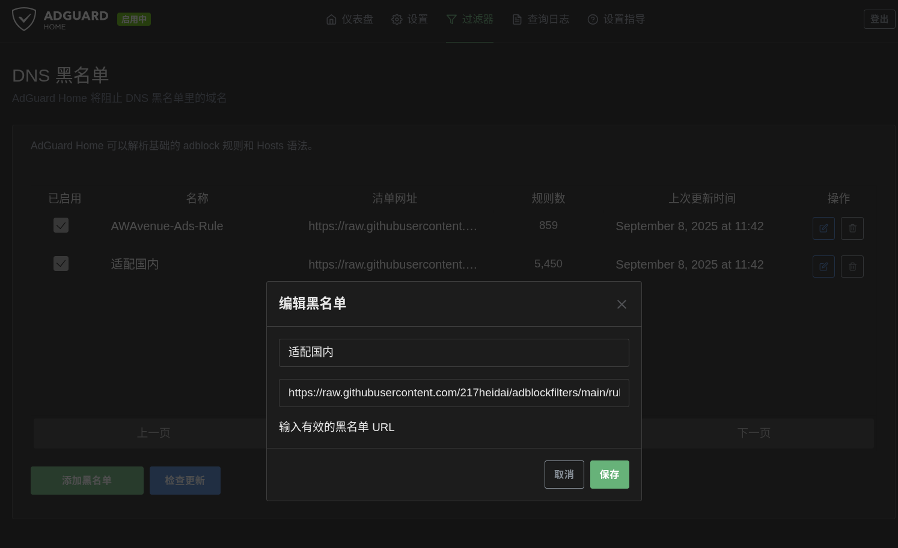
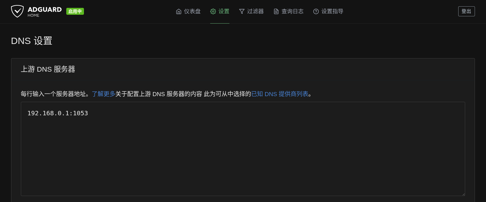
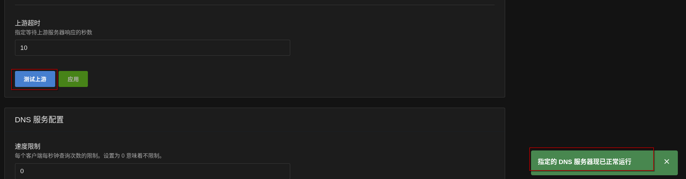

之前一直在用的华为天际通流量卡因为不可抗因素强制换卡，考虑到本身流量限制越来越多，所以干脆重新物色一款合适的卡。我在酷安刷了半天，最终决定拿下中兴 V50 这款路由，内置电信移动双网，到手试了试，在我待的地方，这两信号那是比联通强太多了，我当场把天际通配套的华为路由器挂鱼处理。

我考虑中兴 V50 这款路由的一大因素，就是有大佬给它做工具（此处感谢 kano 大佬的 [UFI-TOOLS](https://github.com/kanoqwq/UFI-TOOLS) ），这篇博客的诞生也是因为实际使用工具时，踩了很多坑，需要记录一下防止再踩。

## mihomo 插件设置

UFI-TOOLS 工具内的插件商店带了大佬自制的 mihomo 插件，直接一键安装就行了。安装完成后我用插件默认的 mihomo 配置订阅自己的服务后，发现 zashboard 巨卡无比，定位原因发现是配置里的规则太多太细，配上我服务里的几百台 proxy，页面加载的东西太多了，于是我在 mihomo 官方配置的基础上，合并了插件默认的部分配置，最终得到了下面精简的配置。

```yaml
proxy-providers:
  provider1:
    url: "改成自己的订阅url"
    type: http
    interval: 86400
    health-check: {enable: true,url: "https://www.gstatic.com/generate_204",interval: 300}
    override:
      additional-prefix: "[provider1]"

proxies: 
  - name: "直连"
    type: direct
    udp: true

mixed-port: 7890
redir-port: 7891
tproxy-port: 1536
ipv6: true
mode: Rule
allow-lan: true
disable-keep-alive: true
geodata-mode: false
geo-auto-update: true
geo-update-interval: 24
geox-url:
  asn: "https://github.com/MetaCubeX/meta-rules-dat/releases/download/latest/GeoLite2-ASN.mmdb"
experimental:
  http-headers:
    request:
      - name: "User-Agent"
        value: "Mozilla/5.0 (Linux; Android 10; K) AppleWebKit/537.36 (KHTML, like Gecko) Chrome/135.0.0.0 Mobile Safari/537.36"
      - name: "Accept-Language"
        value: "en-US,en;q=0.9"
unified-delay: true
tcp-concurrent: true
log-level: silent
find-process-mode: always
global-client-fingerprint: chrome

external-controller: 0.0.0.0:7788
secret: "123456"
external-ui: WebUI/ZashBoard
external-ui-url: "https://github.com/Zephyruso/zashboard/releases/latest/download/dist.zip"
external-controller-cors:
  allow-origins:
    - "*"
  allow-private-network: true

profile:
  store-selected: true
  store-fake-ip: true

sniffer:
  enable: true
  sniff:
    HTTP:
      ports: [80, 8080-8880]
      override-destination: true
    TLS:
      ports: [443, 8443]
    QUIC:
      ports: [443, 8443]
  skip-domain:
    - "Mijia Cloud"
    - "+.push.apple.com"

tun:
  enable: true
  stack: mixed
  dns-hijack:
    - "any:53"
    - "tcp://any:53"
  auto-route: true
  auto-redirect: true
  auto-detect-interface: true

dns:
  enable: true
  ipv6: true
  enhanced-mode: fake-ip
  fake-ip-filter:
    - "*"
    - "+.lan"
    - "+.local"
    - "+.market.xiaomi.com"
  default-nameserver:
    - tls://223.5.5.5
    - tls://223.6.6.6
  nameserver:
    - https://doh.pub/dns-query
    - https://dns.alidns.com/dns-query

proxy-groups:

  - name: 默认
    type: select
    proxies: [自动选择,直连,香港,台湾,日本,新加坡,美国,其它地区,全部节点]

  - name: Google
    type: select
    proxies: [默认,香港,台湾,日本,新加坡,美国,其它地区,全部节点,自动选择,直连]

  - name: Telegram
    type: select
    proxies: [默认,香港,台湾,日本,新加坡,美国,其它地区,全部节点,自动选择,直连]

  - name: Twitter
    type: select
    proxies: [默认,香港,台湾,日本,新加坡,美国,其它地区,全部节点,自动选择,直连]

  - name: 哔哩哔哩
    type: select
    proxies: [默认,香港,台湾,日本,新加坡,美国,其它地区,全部节点,自动选择,直连]

  - name: 巴哈姆特
    type: select
    proxies: [默认,香港,台湾,日本,新加坡,美国,其它地区,全部节点,自动选择,直连]

  - name: YouTube
    type: select
    proxies: [默认,香港,台湾,日本,新加坡,美国,其它地区,全部节点,自动选择,直连]

  - name: NETFLIX
    type: select
    proxies: [默认,香港,台湾,日本,新加坡,美国,其它地区,全部节点,自动选择,直连]

  - name: Spotify
    type: select
    proxies:  [默认,香港,台湾,日本,新加坡,美国,其它地区,全部节点,自动选择,直连]

  - name: Github
    type: select
    proxies:  [默认,香港,台湾,日本,新加坡,美国,其它地区,全部节点,自动选择,直连]

  - name: 国内
    type: select
    proxies:  [直连,默认,香港,台湾,日本,新加坡,美国,其它地区,全部节点,自动选择]

  - name: 其他
    type: select
    proxies:  [默认,香港,台湾,日本,新加坡,美国,其它地区,全部节点,自动选择,直连]

  #分隔,下面是地区分组
  - name: 香港
    type: select
    include-all: true
    exclude-type: direct
    filter: "(?i)港|hk|hongkong|hong kong"

  - name: 台湾
    type: select
    include-all: true
    exclude-type: direct
    filter: "(?i)台|tw|taiwan"

  - name: 日本
    type: select
    include-all: true
    exclude-type: direct
    filter: "(?i)日|jp|japan"

  - name: 美国
    type: select
    include-all: true
    exclude-type: direct
    filter: "(?i)美|us|unitedstates|united states"

  - name: 新加坡
    type: select
    include-all: true
    exclude-type: direct
    filter: "(?i)(新|sg|singapore)"

  - name: 其它地区
    type: select
    include-all: true
    exclude-type: direct
    filter: "(?i)^(?!.*(?:🇭🇰|🇯🇵|🇺🇸|🇸🇬|🇨🇳|港|hk|hongkong|台|tw|taiwan|日|jp|japan|新|sg|singapore|美|us|unitedstates)).*"

  - name: 全部节点
    type: select
    include-all: true
    exclude-type: direct

  - name: 自动选择
    type: url-test
    include-all: true
    exclude-type: direct
    tolerance: 10

rules:
  - GEOIP,lan,直连,no-resolve
  - GEOSITE,github,Github
  - GEOSITE,twitter,Twitter
  - GEOSITE,youtube,YouTube
  - GEOSITE,google,Google
  - GEOSITE,telegram,Telegram
  - GEOSITE,netflix,NETFLIX
  - GEOSITE,bilibili,哔哩哔哩
  - GEOSITE,bahamut,巴哈姆特
  - GEOSITE,spotify,Spotify
  - GEOSITE,CN,国内
  - GEOSITE,geolocation-!cn,其他

  - GEOIP,google,Google
  - GEOIP,netflix,NETFLIX
  - GEOIP,telegram,Telegram
  - GEOIP,twitter,Twitter
  - GEOIP,CN,国内
  - MATCH,其他

```

## AdGuard Home 插件设置

工具的插件仓库里也带了 AdGuard Home 插件，那肯定得好好用起来，一键安装完成后，直接在 [adblockfilters](https://github.com/217heidai/adblockfilters?tab=readme-ov-file) 找了适合自己的拦截规则设置到 DNS 黑名单里。



## AdGuard 和 mihomo 的协同

在同时存在的场景下，这两谁都可以做对方的上游，但是先用 AdGuard 过滤，再用 mihomo 分流，这样明显效率更高。所以我们要将 mihomo 设置为 AdGuard 的上游。

1. 设置 mihomo 监听 1053 端口
  ```yaml
  dns:
    enable: true
    ipv6: true
    listen: 0.0.0.0:1053 # 新增这行
    enhanced-mode: fake-ip
  ```
2. 修改 AdGuard 的 DNS 上游为 192.168.0.1:1053
  
3. 检查 AdGuard 修改结果
  

## git 连接 github 问题

开启 mihomo 后，proxy 提供商可能会屏蔽 22 端口，导致 git 和 github 建立 ssh 连接失败，报错提示如下：

```bash
# git push
wzj@wzj-debian:~/Project/blog$ git push
Connection closed by 198.18.0.252 port 22
fatal: Could not read from remote repository.

Please make sure you have the correct access rights
and the repository exists.

# ssh -vvv git@github.com
wzj@wzj-debian:~/Project/blog$ ssh -vvv git@github.com
debug1: OpenSSH_10.0p2 Debian-7, OpenSSL 3.5.1 1 Jul 2025
debug3: Running on Linux 6.12.43+deb13-amd64 #1 SMP PREEMPT_DYNAMIC Debian 6.12.43-1 (2025-08-27) x86_64
debug3: Started with: ssh -vvv git@github.com
...
debug1: Local version string SSH-2.0-OpenSSH_10.0p2 Debian-7
kex_exchange_identification: Connection closed by remote host
Connection closed by 198.18.0.252 port 22

```

此时我们可以选择改为 443 端口连接，参考[github提供的说明](https://docs.github.com/en/authentication/troubleshooting-ssh/using-ssh-over-the-https-port#enabling-ssh-connections-over-https)，在`~/.ssh/config`里增加下面这部分即可：

```bash
Host github.com
    Hostname ssh.github.com
    Port 443
    User git
```
